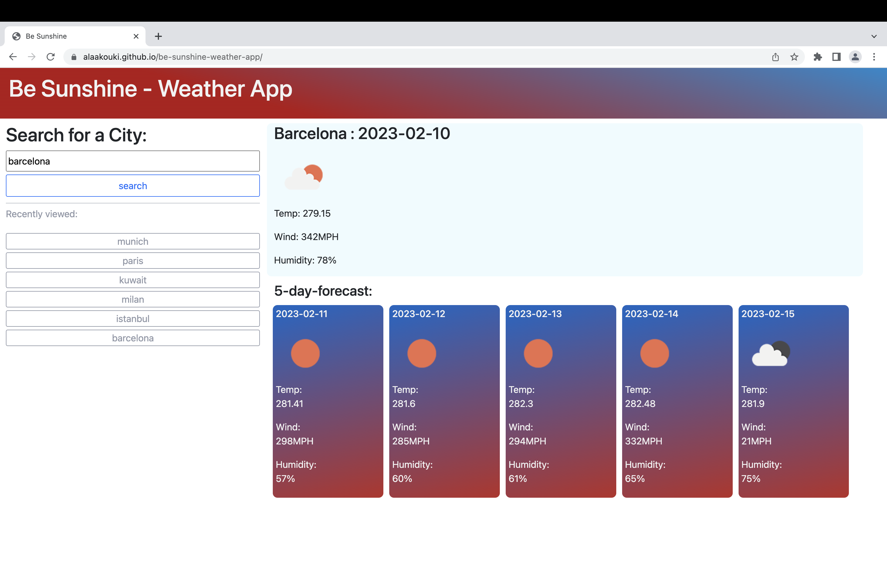
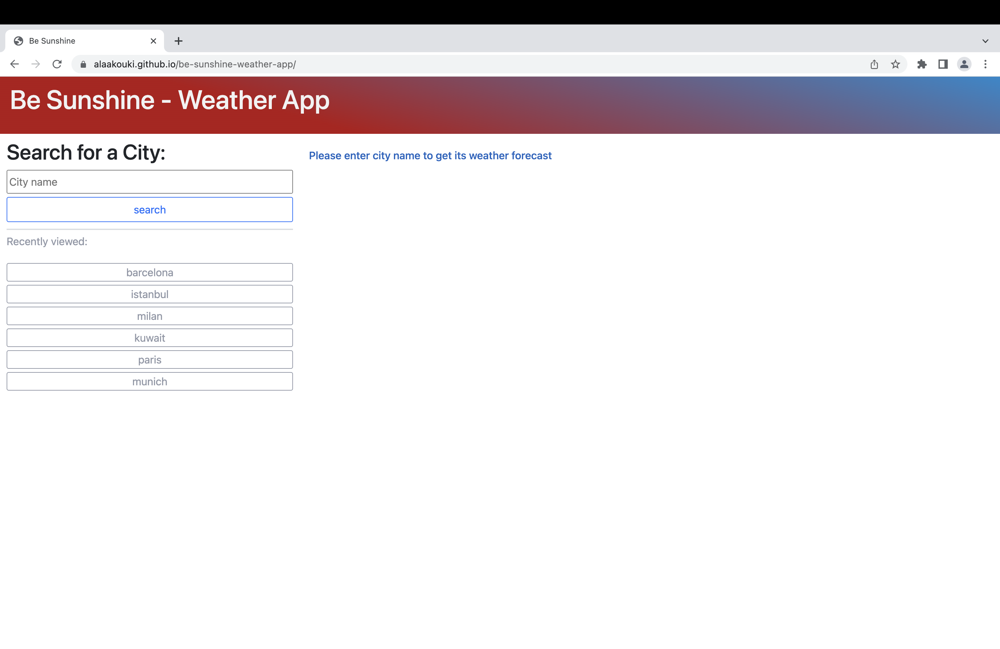

# be-sunshine-weather-app
Be Sunshine - Weather App, it's a (weather dashboard) allowing you to check the current weather forecast with full information of temperature, wind speed and humidity for current day & five days more via city name.

## Way to use it:
* Put requested city name in search field at Search for a City and press search button.
* information will appear on right side.
* If you already searched before for a city, you can find it under Recently viewed and all you need to press on its name again to re-open it again

## Mock-up
 Be Sunshine Weather App webpage URL:
 https://alaakouki.github.io/be-sunshine-weather-app/

The following image is how Be Sunshine Weather App webpage shows to
users on desktop screens:

